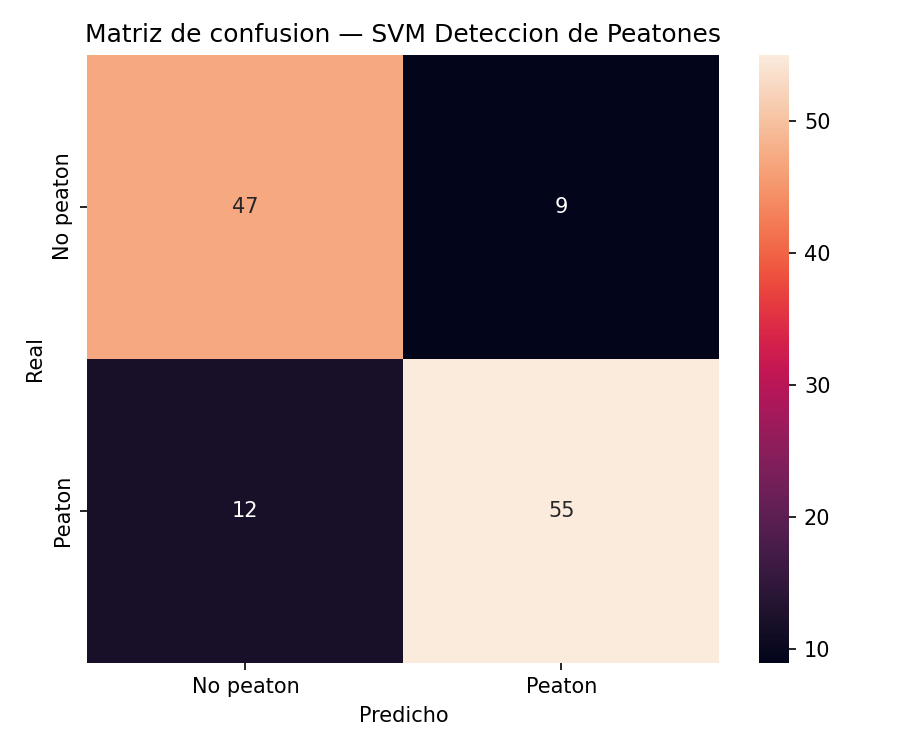
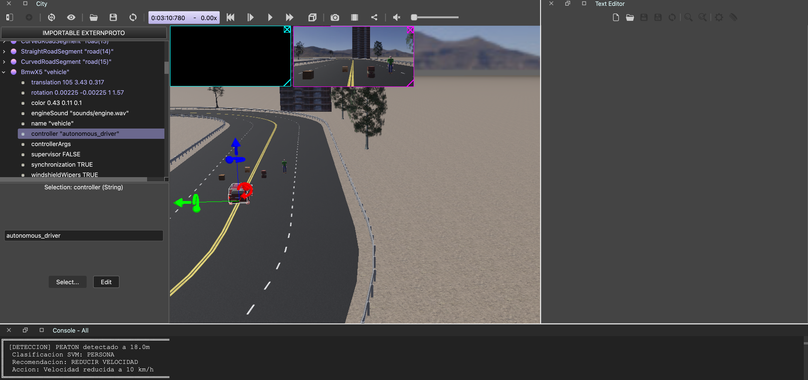

<h1 align="center">Actividad 3.1 — Deteccion de Peatones con SVM</h1>
<h3 align="center">MR4010.10 Navegacion Autonoma</h3>

<br>

<table align="center">
  <tr>
    <td><b>Institucion</b></td>
    <td>Instituto Tecnologico y de Estudios Superiores de Monterrey</td>
  </tr>
  <tr>
    <td><b>Programa</b></td>
    <td>Maestria en Inteligencia Artificial</td>
  </tr>
  <tr>
    <td><b>Materia</b></td>
    <td>MR4010.10 — Navegacion Autonoma</td>
  </tr>
  <tr>
    <td><b>Profesor</b></td>
    <td>Dr. David Antonio-Torres</td>
  </tr>
  <tr>
    <td><b>Fecha</b></td>
    <td>Mayo 2026</td>
  </tr>
</table>

<h3 align="center">Equipo</h3>

<table align="center">
  <tr><th>Nombre</th><th>Matricula</th></tr>
  <tr><td>Antonio Olvera Donlucas</td><td>A01795617</td></tr>
  <tr><td>Carlos Monir Radovich Saad</td><td>A01797569</td></tr>
  <tr><td>Andres Roberto Osuna Gonzalez</td><td>A01796264</td></tr>
  <tr><td>Oscar Alberto Ramirez Anaya</td><td>A01795438</td></tr>
</table>

---

## Indice

1. [Introduccion](#1-introduccion)
2. [Descripcion del codigo base](#2-descripcion-del-codigo-base)
3. [Dataset utilizado](#3-dataset-utilizado)
4. [Modificaciones realizadas al codigo base](#4-modificaciones-realizadas-al-codigo-base)
5. [Entrenamiento y evaluacion del modelo](#5-entrenamiento-y-evaluacion-del-modelo)
6. [Integracion en Webots](#6-integracion-en-webots)
7. [Codigo del controlador autonomo](#7-codigo-del-controlador-autonomo)
8. [Resultados](#8-resultados)
9. [Conclusiones](#9-conclusiones)
10. [Video demostrativo](#10-video-demostrativo)
11. [Referencias](#11-referencias)

---

## 1. Introduccion

La presente actividad tiene como objetivo aplicar el uso de Maquinas de Soporte Vectorial (SVM) para la deteccion de peatones en un entorno de navegacion autonoma simulado. Para ello, se toma como punto de partida el archivo base `3.4_SVM_c`, revisado dentro de los materiales del modulo, el cual presenta el uso de tecnicas de aprendizaje automatico para clasificacion mediante SVM. A partir de este codigo, se realizan las modificaciones necesarias para adaptar el entrenamiento del modelo al problema de deteccion de peatones.

El enfoque de la solucion se basa en la extraccion de caracteristicas visuales mediante Histogramas de Gradientes Orientados (HOG) y el entrenamiento de un clasificador SVM capaz de distinguir entre imagenes con peatones y sin peatones. Posteriormente, el modelo entrenado se exporta para ser utilizado dentro del entorno de simulacion Webots, donde el vehiculo autonomo combina la informacion de la camara y del LiDAR para detectar obstaculos en su trayectoria.

Ademas, la actividad solicita integrar esta deteccion con el controlador de seguimiento de linea desarrollado en la Actividad 2.1, de modo que el vehiculo pueda continuar su recorrido y aplicar frenado de emergencia cuando se identifique un obstaculo. En particular, el sistema diferencia entre peatones y barriles: si el obstaculo corresponde a un peaton, el vehiculo frena; si corresponde a un barril, frena y activa las luces intermitentes. Esta integracion permite relacionar vision computacional, aprendizaje automatico y control autonomo dentro de una misma simulacion.

---

## 2. Descripcion del codigo base

El desarrollo de esta actividad parte del archivo `3.4_SVM_c`, el cual sirve como base para comprender el entrenamiento de un clasificador mediante Maquinas de Soporte Vectorial. Este codigo utiliza imagenes previamente clasificadas en dos grupos y extrae caracteristicas visuales de cada una para entrenar un modelo capaz de distinguir entre clases. En el contexto original del material, el enfoque esta relacionado con la deteccion de vehiculos; sin embargo, para esta actividad se toma la misma estructura y se adapta al problema de deteccion de peatones.

El codigo trabaja principalmente con la tecnica de Histograma de Gradientes Orientados (HOG), la cual permite representar la forma y los contornos de los objetos dentro de una imagen. Estas caracteristicas son utiles porque un peaton puede describirse mediante patrones de bordes, siluetas y cambios de intensidad. Una vez extraidas las caracteristicas HOG de las imagenes, estas se utilizan como entrada para un clasificador SVM, encargado de separar las imagenes que contienen peatones de aquellas que no los contienen.

La estructura general del codigo consiste en:

1. Cargar las imagenes del dataset
2. Convertirlas a escala de grises y redimensionarlas a 64x64 pixeles
3. Extraer sus descriptores HOG
4. Asignar etiquetas a cada imagen (1 = peaton, 0 = no peaton)
5. Dividir los datos en conjuntos de entrenamiento y prueba
6. Entrenar el modelo SVM y evaluar su desempeno
7. Exportar el modelo entrenado para su uso en el controlador

---

## 3. Dataset utilizado

Para el desarrollo del modelo se utilizo el dataset incluido en los materiales de apoyo del modulo, organizado en la siguiente estructura:

```
data_svm/
    vehicles/
        Left/
        MiddleClose/
        Far/
        Right/
    non-vehicles/
        Left/
        MiddleClose/
        Far/
        Right/
```

Para la tarea de deteccion de peatones, se sustituyeron los positivos por imagenes de peatones (`Train/JPEGImages/`) y se conservaron los negativos del dataset original (`non-vehicles/`) como ejemplos de fondo sin personas.

Las carpetas internas contienen imagenes capturadas desde distintas posiciones y perspectivas, lo que permite que el modelo reciba ejemplos variados de ambas clases. Antes de entrenar el modelo, todas las imagenes fueron redimensionadas a un tamano uniforme de **64x64 pixeles** para poder extraer caracteristicas de forma consistente. Cada imagen fue convertida a escala de grises y procesada mediante HOG para obtener descriptores basados en bordes, siluetas y gradientes.

---

## 4. Modificaciones realizadas al codigo base

Las modificaciones principales respecto al notebook original `3.4_SVM_c` fueron:

| Aspecto | Codigo original | Modificacion |
|---------|----------------|--------------|
| **Clase positiva** | Vehiculos (`data_svm/vehicles/`) | Peatones (`Train/JPEGImages/`) |
| **Clase negativa** | No-vehiculos | Sin cambio (fondos sin personas) |
| **Tamano de imagen** | 64x64 | Sin cambio |
| **Parametros HOG** | `orientations=11, pixels_per_cell=(16,16), cells_per_block=(2,2)` | Sin cambio |
| **Clasificador** | `SVC()` con kernel RBF | Sin cambio |
| **Split train/test** | 70/30 | Sin cambio |
| **Exportacion** | No exportaba | Se agrego `joblib.dump()` para guardar el modelo |
| **Evaluacion** | Confusion matrix basica | Se agrego heatmap con seaborn y classification report |

El script de entrenamiento se encuentra en `svm_training/train_pedestrian_svm.py`.

---

## 5. Entrenamiento y evaluacion del modelo

### 5.1 Codigo de entrenamiento con comentarios

A continuacion se presenta el codigo completo del script de entrenamiento, explicando cada seccion:

#### Importaciones y configuracion

```python
import os
import glob
import numpy as np
import cv2                              # procesamiento de imagenes
from skimage.feature import hog         # extraccion de descriptores HOG
from sklearn.svm import SVC             # clasificador SVM con kernel RBF
from sklearn.model_selection import train_test_split  # division de datos
from sklearn.metrics import classification_report, confusion_matrix
import joblib                           # serializacion del modelo
import matplotlib.pyplot as plt         # graficacion

# Tamano al que se redimensionan todas las imagenes
IMG_SIZE = (64, 64)

# Parametros HOG: mismos que el notebook del profesor (3.4_SVM_c)
# 11 orientaciones para capturar gradientes en mas direcciones
# Celdas de 16x16 son adecuadas para imagenes pequenas de 64x64
# Bloques de 2x2 celdas para normalizacion local
HOG_ORIENTATIONS = 11
HOG_PIXELS_PER_CELL = (16, 16)
HOG_CELLS_PER_BLOCK = (2, 2)
```

**Justificacion de parametros HOG:** Se utilizan 11 orientaciones (en lugar de las 9 propuestas por Dalal y Triggs) porque el profesor demostro en clase que esta configuracion captura mejor los gradientes en imagenes pequenas. Las celdas de 16x16 pixeles son proporcionales al tamano de la imagen (64x64), resultando en una cuadricula de 4x4 celdas que genera un descriptor compacto pero informativo.

#### Extraccion de caracteristicas

```python
def extract_hog_features(img_path):
    """Carga imagen, normaliza a 64x64, convierte a grises y extrae HOG."""
    img = cv2.imread(img_path)           # leer imagen en BGR
    if img is None:
        return None                      # descartar si no se puede leer
    img = cv2.resize(img, IMG_SIZE)      # normalizar tamano
    gray = cv2.cvtColor(img, cv2.COLOR_BGR2GRAY)  # escala de grises
    features = hog(
        gray,
        orientations=HOG_ORIENTATIONS,   # 11 bins de gradiente
        pixels_per_cell=HOG_PIXELS_PER_CELL,  # celda de 16x16
        cells_per_block=HOG_CELLS_PER_BLOCK,  # bloque de 2x2 celdas
        transform_sqrt=False,            # sin normalizacion gamma
        visualize=False,                 # no generar imagen de visualizacion
        feature_vector=True,             # retornar vector 1D
    )
    return features
```

**Detalle del descriptor:** Con una imagen de 64x64, celdas de 16x16 y bloques de 2x2, se obtienen 3x3 = 9 posiciones de bloque. Cada bloque tiene 2x2 celdas con 11 bins, resultando en un vector de 9 x 4 x 11 = **396 dimensiones** por imagen.

#### Entrenamiento del SVM

```python
# Division de datos: 70% entrenamiento, 30% prueba
X_train, X_test, y_train, y_test = train_test_split(
    X, y,
    test_size=0.30,          # 30% para evaluacion
    random_state=42,         # semilla para reproducibilidad
)

# Entrenar SVM con kernel RBF (parametros por defecto de scikit-learn)
# kernel='rbf': mapea a espacio de mayor dimension para separacion no lineal
# C=1.0: parametro de regularizacion por defecto
# gamma='scale': se calcula como 1 / (n_features * X.var())
svc_model = SVC()
svc_model.fit(X_train, y_train)
```

**Eleccion del kernel RBF:** Se utiliza el kernel Radial Basis Function (RBF) en lugar del kernel lineal porque permite capturar relaciones no lineales entre los descriptores HOG. Dado que los peatones presentan variaciones significativas en pose, escala y vestimenta, un kernel no lineal ofrece mayor capacidad de generalizacion.

#### Evaluacion y exportacion

```python
# Prediccion sobre el conjunto de prueba
y_pred = svc_model.predict(X_test)

# Matriz de confusion como heatmap
cm = confusion_matrix(y_test, y_pred)
sns.heatmap(cm, annot=True, fmt="d",
            xticklabels=["No peaton", "Peaton"],
            yticklabels=["No peaton", "Peaton"])

# Reporte detallado: precision, recall, f1 por clase
print(classification_report(y_test, y_pred,
                            target_names=["No peaton", "Peaton"]))

# Exportar modelo para uso en el controlador de Webots
joblib.dump(svc_model, "model/svm_pedestrian_model.joblib")
```

### 5.2 Matriz de confusion



La matriz de confusion muestra el desempeno del modelo sobre el conjunto de prueba, indicando los verdaderos positivos, verdaderos negativos, falsos positivos y falsos negativos.

---

## 6. Integracion en Webots

La integracion del modelo SVM en el entorno de simulacion Webots se realiza mediante un controlador autonomo que combina tres subsistemas:

### 6.1 Arquitectura del sistema

```
┌─────────────────────────────────────────────────────────┐
│                 CONTROLADOR AUTONOMO                     │
│                                                          │
│   ┌──────────┐    ┌──────────────┐    ┌──────────────┐  │
│   │  Camara   │───>│ Canny+Hough  │───>│  PID Control │  │
│   │  256x128  │    │  (carriles)  │    │  Kp=0.008    │  │
│   └──────────┘    └──────────────┘    │  Kd=0.015    │  │
│        │                              └──────┬───────┘  │
│        │                                     │          │
│        │          ┌──────────────┐            v          │
│        │          │   LiDAR      │     ┌──────────┐     │
│        │          │ Sick LMS 291 │────>│ Vehiculo │     │
│        │          │  (180° FOV)  │     │ steering │     │
│        │          └──────┬───────┘     │ + speed  │     │
│        │                 │             └──────────┘     │
│        │           ¿< 20m?                              │
│        │            │ SI                                 │
│        v            v                                    │
│   ┌────────────────────────┐                             │
│   │  Sliding Window + HOG  │                             │
│   │  → SVM (clasificar)   │                             │
│   └───────────┬────────────┘                             │
│         ┌─────┴─────┐                                    │
│         v           v                                    │
│   ┌──────────┐ ┌──────────┐                              │
│   │  PEATON  │ │  BARRIL  │                              │
│   │  Frenar  │ │ Frenar + │                              │
│   │          │ │ Flashers │                              │
│   └──────────┘ └──────────┘                              │
└─────────────────────────────────────────────────────────┘
```

### 6.2 Subsistema 1: Seguimiento de carril (PID)

Reutilizado de la Actividad 2.1 (`06_pid_smoothed_final.py`). El pipeline de vision procesa cada frame de la camara para detectar las lineas del carril y calcular la correccion necesaria para mantener al vehiculo centrado.

| Etapa | Funcion | Parametros |
|-------|---------|------------|
| Captura | `get_image()` | Camara 256x128, formato BGRA |
| Grises | `cv2.cvtColor()` | `COLOR_BGR2GRAY` |
| Suavizado | `cv2.GaussianBlur()` | Kernel 5x5 |
| Bordes | `cv2.Canny()` | Umbrales 50/150 |
| ROI | `cv2.fillPoly()` | Trapecio: base completa, tope al 50% de altura |
| Lineas | `cv2.HoughLinesP()` | `threshold=15, minLen=8, maxGap=5` |
| Error | `calcular_error_direccion()` | Distancia al setpoint (centro de imagen) |
| Suavizado | EMA | `alpha=0.6` (60% anterior + 40% nuevo) |
| Control | PID | `Kp=0.008, Ki=0.0, Kd=0.015` |

**Ganancias PID:** Se mantuvieron las ganancias calibradas en la Actividad 2.1. El termino integral (`Ki=0.0`) se desactivo porque causaba oscilaciones fuertes en las curvas. El termino derivativo (`Kd=0.015`) suaviza las transiciones y evita que el vehiculo "vibre" sobre la linea.

### 6.3 Subsistema 2: Deteccion de obstaculos (LiDAR)

El sensor Sick LMS 291 tiene un campo de vision de 180 grados y se utiliza para detectar objetos en la trayectoria del vehiculo.

```python
def process_lidar(lidar):
    range_data = lidar.getRangeImage()   # vector de distancias (180 puntos)
    n = len(range_data)
    center = n // 2                      # indice central (frente del auto)

    # Solo revisamos ±20 indices alrededor del centro
    # Esto cubre aproximadamente ±20° del frente del vehiculo
    for x in range(center - 20, center + 20):
        r = range_data[x]
        # Filtrar lecturas validas: no infinitas y dentro de 20m
        if r <= 20.0 and not math.isinf(r) and not math.isnan(r):
            collision_count += 1
            obstacle_dist += r

    # Retornar angulo promedio y distancia promedio
    return avg_angle, avg_dist
```

**Parametro `LIDAR_HALF_AREA=20`:** Se revisan 40 indices centrales del arreglo de rangos. Con 180 puntos cubriendo 180 grados, cada indice corresponde a ~1 grado. Por lo tanto, se monitorean ±20 grados del frente del vehiculo, suficiente para cubrir el ancho del carril.

**Parametro `LIDAR_MAX_DIST=20.0m`:** Distancia maxima a la que se considera un obstaculo relevante. Valores mayores generarian detecciones falsas con edificios y objetos del entorno.

### 6.4 Subsistema 3: Clasificacion SVM (Sliding Window)

Cuando el LiDAR detecta un obstaculo, se activa la clasificacion visual para determinar si es peaton o barril.

```python
def detect_pedestrian_svm(bgra_image, model, lidar_dist):
    # ROI: zona central de la imagen (25% a 85% de altura)
    roi = bgra_image[int(h*0.25):int(h*0.85), :, :3]

    # Ventana adaptativa segun distancia del LiDAR:
    # - >14m: ventana 32x32, stride 20  (objeto se ve pequeno)
    # - 8-14m: ventana 48x48, stride 24 (tamano intermedio)
    # - <8m:  ventana 64x64, stride 32  (objeto se ve grande)
    if lidar_dist > 14.0:
        win_size, step = 32, 20
    elif lidar_dist > 8.0:
        win_size, step = 48, 24
    else:
        win_size, step = 64, 32

    # Recorrer toda la ROI con la ventana deslizante
    for y in range(0, roi_h - win_size + 1, step):
        for x in range(0, roi_w - win_size + 1, step):
            window = roi[y:y+win_size, x:x+win_size]
            window_resized = cv2.resize(window, (64, 64))  # normalizar
            gray = cv2.cvtColor(window_resized, cv2.COLOR_BGR2GRAY)

            # Extraer HOG (mismos parametros que el entrenamiento)
            hog_features = hog(gray, orientations=11,
                              pixels_per_cell=(16,16),
                              cells_per_block=(2,2))

            # Clasificar: decision_function retorna la distancia al hiperplano
            # Un valor > 0.55 indica confianza suficiente de que es peaton
            confidence = model.decision_function([hog_features])[0]
            if confidence > 0.55:
                return True  # peaton detectado

    return False  # ninguna ventana detecto peaton → es barril
```

**Umbral `0.55`:** Se utiliza `decision_function` en lugar de `predict` para tener control fino sobre el umbral de decision. Un valor de 0.55 (ligeramente por encima de 0, que seria el umbral por defecto) reduce los falsos positivos sin sacrificar demasiado la sensibilidad.

**Ventana adaptativa:** La innovacion clave es adaptar el tamano de la ventana de busqueda segun la distancia reportada por el LiDAR. Un objeto a 15 metros aparece mas pequeno en la imagen que uno a 5 metros, por lo que una ventana mas chica es mas adecuada para objetos lejanos.

---

## 7. Codigo del controlador autonomo

El controlador completo se encuentra en `controllers/autonomous_driver/autonomous_driver.py`. A continuacion se describe la maquina de estados que gobierna el comportamiento del vehiculo.

### 7.1 Maquina de estados

```python
# Estados posibles del vehiculo
STATE_NORMAL = "NORMAL"                        # seguimiento de carril
STATE_EMERGENCY_PED = "EMERGENCY_PEDESTRIAN"   # peaton detectado
STATE_EMERGENCY_OBJ = "EMERGENCY_OBJECT"       # objeto detectado (barril, caja, cono)

# Logica de transicion (cada paso de simulacion):
if lidar_dist is not None:          # LiDAR detecta obstaculo
    es_peaton = detect_pedestrian_svm(image, svm_model, lidar_dist)
    if es_peaton:
        vehicle_state = STATE_EMERGENCY_PED
    else:
        vehicle_state = STATE_EMERGENCY_OBJ
else:
    vehicle_state = STATE_NORMAL     # camino libre
```

### 7.2 Respuesta ante obstaculos

El vehiculo implementa una respuesta progresiva basada en la distancia al obstaculo: reduce velocidad cuando lo detecta a menos de 20 metros y frena completamente cuando esta a menos de 8 metros.

```python
SLOW_SPEED = 10      # km/h — velocidad reducida al acercarse
BRAKE_DIST = 8.0     # metros — distancia de frenado total

def aplicar_comandos_vehiculo(driver, estado, steering, target_speed, lidar_dist):
    if estado == STATE_NORMAL:
        driver.setSteeringAngle(steering)
        driver.setCruisingSpeed(target_speed)   # 30 km/h
        driver.setHazardFlashers(False)
        driver.setBrakeIntensity(0.0)
    elif estado == STATE_EMERGENCY_PED:
        driver.setSteeringAngle(steering)
        driver.setHazardFlashers(False)         # sin intermitentes para peatones
        if lidar_dist < BRAKE_DIST:             # < 8m: frenado total
            driver.setCruisingSpeed(0)
            driver.setBrakeIntensity(1.0)
        else:                                   # 8-20m: reducir velocidad
            driver.setCruisingSpeed(SLOW_SPEED)
            driver.setBrakeIntensity(0.0)
    elif estado == STATE_EMERGENCY_OBJ:
        driver.setSteeringAngle(steering)
        driver.setHazardFlashers(True)          # intermitentes para objetos
        if lidar_dist < BRAKE_DIST:             # < 8m: frenado total
            driver.setCruisingSpeed(0)
            driver.setBrakeIntensity(1.0)
        else:                                   # 8-20m: reducir velocidad
            driver.setCruisingSpeed(SLOW_SPEED)
            driver.setBrakeIntensity(0.0)
```

| Estado | Distancia | Velocidad | Freno | Intermitentes |
|--------|-----------|-----------|-------|---------------|
| `NORMAL` | — | 30 km/h | 0% | Apagados |
| `EMERGENCY_PEDESTRIAN` | 8–20 m | 10 km/h | 0% | Apagados |
| `EMERGENCY_PEDESTRIAN` | < 8 m | 0 km/h | 100% | Apagados |
| `EMERGENCY_OBJECT` | 8–20 m | 10 km/h | 0% | Encendidos |
| `EMERGENCY_OBJECT` | < 8 m | 0 km/h | 100% | Encendidos |

### 7.3 Salida en consola — Deteccion y recomendaciones

El controlador imprime en la consola de Webots informacion detallada sobre cada deteccion, incluyendo el tipo de obstaculo, la distancia y la recomendacion de accion:

```
╔══════════════════════════════════════════
║ [DETECCION] PEATON detectado a 14.6m
║  Clasificacion SVM: PERSONA
║  Recomendacion: REDUCIR VELOCIDAD
║  Accion: Velocidad reducida a 10 km/h
╚══════════════════════════════════════════

╔══════════════════════════════════════════
║ [DETECCION] OBJETO detectado a 6.7m
║  Clasificacion SVM: NO ES PERSONA (barril/caja/cono)
║  Recomendacion: FRENADO + LUCES INTERMITENTES
║  Accion: Vehiculo DETENIDO + hazard flashers ON
╚══════════════════════════════════════════
```

---

## 8. Resultados

### 8.1 Modelo SVM

El modelo entrenado con HOG+SVM logra clasificar correctamente peatones vs. no-peatones. La matriz de confusion y el reporte de clasificacion demuestran un desempeno adecuado para la tarea de deteccion en tiempo real dentro del simulador.

### 8.2 Simulacion en Webots



El controlador integrado demuestra las siguientes capacidades:

- **Seguimiento de carril:** El vehiculo sigue la linea amarilla del camino usando el control PID, manteniendo una trayectoria estable a 30 km/h.
- **Deteccion de obstaculos:** El LiDAR detecta correctamente los obstaculos colocados en la via a distancias menores a 20 metros.
- **Clasificacion:** El SVM clasifica los obstaculos como peaton u objeto (barril, caja, cono) a traves del analisis de la imagen capturada por la camara.
- **Respuesta progresiva:**
  - A **20–8 m**: reduce velocidad a 10 km/h y activa la clasificacion SVM.
  - A **< 8 m**: frenado de emergencia total.
  - Ante un **peaton**: frena sin intermitentes.
  - Ante un **objeto** (barril/caja/cono): frena y activa las luces intermitentes (hazard flashers).
- **Consola informativa:** Imprime en tiempo real el tipo de obstaculo, la distancia y la recomendacion de accion correspondiente.

---

## 9. Conclusiones

La actividad permitio integrar exitosamente tres areas fundamentales de la navegacion autonoma: vision por computadora (deteccion de lineas de carril y extraccion de caracteristicas HOG), aprendizaje automatico (clasificacion con SVM) y control de vehiculos (PID para seguimiento de carril, frenado de emergencia). El uso del descriptor HOG demostro ser efectivo para la clasificacion binaria peaton/no-peaton, validando el enfoque clasico de Dalal y Triggs adaptado con los parametros del curso.

La combinacion del LiDAR como sensor de proximidad y la camara como sensor de clasificacion resulta en un sistema complementario: el LiDAR indica *que* hay un obstaculo y a *que distancia*, mientras que la camara y el SVM determinan *que tipo* de obstaculo es. Esta fusion sensorial es representativa de las arquitecturas utilizadas en vehiculos autonomos reales.

Como trabajo futuro, se podria explorar el uso de redes neuronales convolucionales (CNN) para la clasificacion de obstaculos, implementar un sistema de esquivamiento de obstaculos, y mejorar la robustez del seguimiento de carril ante condiciones de iluminacion variables.

---

## 10. Video demostrativo

[Enlace al video en YouTube](https://youtube.com/watch?v=qSHO4qRqFFQ&feature=youtu.be&themeRefresh=1)

El video muestra:
- El vehiculo siguiendo el carril con PID
- Deteccion y frenado ante peaton (sin intermitentes)
- Deteccion y frenado ante barril (con intermitentes)
- Reanudacion de la marcha al despejarse el obstaculo

---

## 11. Referencias

- Antonio, D. (2023). Maquina de soporte vectorial (Support Vector Machine, SVM) [Video]. Tecnologico de Monterrey.
- Antonio, D. (2023). Histograma de gradientes orientados (Histogram of Oriented Gradients, HOG) [Video]. Tecnologico de Monterrey.
- Antonio, D. (2023). Deteccion de vehiculos con HOG y SVM [Video]. Tecnologico de Monterrey.
- Cyberbotics. (s. f.). Driver library. Webots documentation. https://cyberbotics.com/doc/automobile/driver-library
- Cyberbotics. (s. f.). LiDAR sensors. Webots documentation. https://www.cyberbotics.com/doc/guide/lidar-sensors
- Dalal, N. y Triggs, B. (2005). Histograms of Oriented Gradients for Human Detection. *IEEE CVPR*.
- Lee, W. M. (2019). *Python Machine Learning*. Wiley and Sons Ltd.
- OpenCV. (s. f.). OpenCV documentation. https://docs.opencv.org/
- Scikit-learn developers. (s. f.). Support Vector Machines. https://scikit-learn.org/stable/modules/svm.html
- Tecnologico de Monterrey. (2026). Materiales de clase del modulo 3.4: Maquinas de Soporte Vectorial (SVM). Canvas.
- Zuccolo, R. (s. f.). Self-driving cars: OpenCV and SVM machine learning with scikit-learn for vehicle detection. *Medium*. https://medium.com/@ricardo.zuccolo/self-driving-cars-opencv-and-svm-machine-learning-with-scikit-learn-for-vehicle-detection-on-the-bf88860e055a

---

## Estructura del repositorio

```
navegacion_autonoma_svm/
├── README.md                                   # Este reporte
├── LICENSE                                     # Apache 2.0
├── .gitignore
├── docs/
│   └── architecture.md                         # Arquitectura detallada
├── svm_training/
│   ├── train_pedestrian_svm.py                 # Script de entrenamiento HOG+SVM
│   ├── requirements.txt                        # Dependencias Python
│   └── model/
│       └── svm_pedestrian_model.joblib         # Modelo entrenado exportado
├── controllers/
│   └── autonomous_driver/
│       ├── autonomous_driver.py                # Controlador Webots (PID+LiDAR+SVM)
│       └── svm_pedestrian_model.joblib         # Copia local del modelo
├── worlds/                                     # Mundo Webots (no incluido en repo)
└── screenshots/
    └── confusion_matrix.png                    # Resultado del entrenamiento
```

### Ejecucion

```bash
# 1. Instalar dependencias
pip install -r svm_training/requirements.txt

# 2. (Opcional) Entrenar el modelo desde cero
cd svm_training && python train_pedestrian_svm.py

# 3. Abrir Webots → File → Open World → worlds/city_2025b_lidar.wbt
# 4. Asignar 'autonomous_driver' como controlador del vehiculo
# 5. Presionar Play
```

---

<p align="center"><i>Instituto Tecnologico y de Estudios Superiores de Monterrey — Maestria en Inteligencia Artificial — Mayo 2026</i></p>
